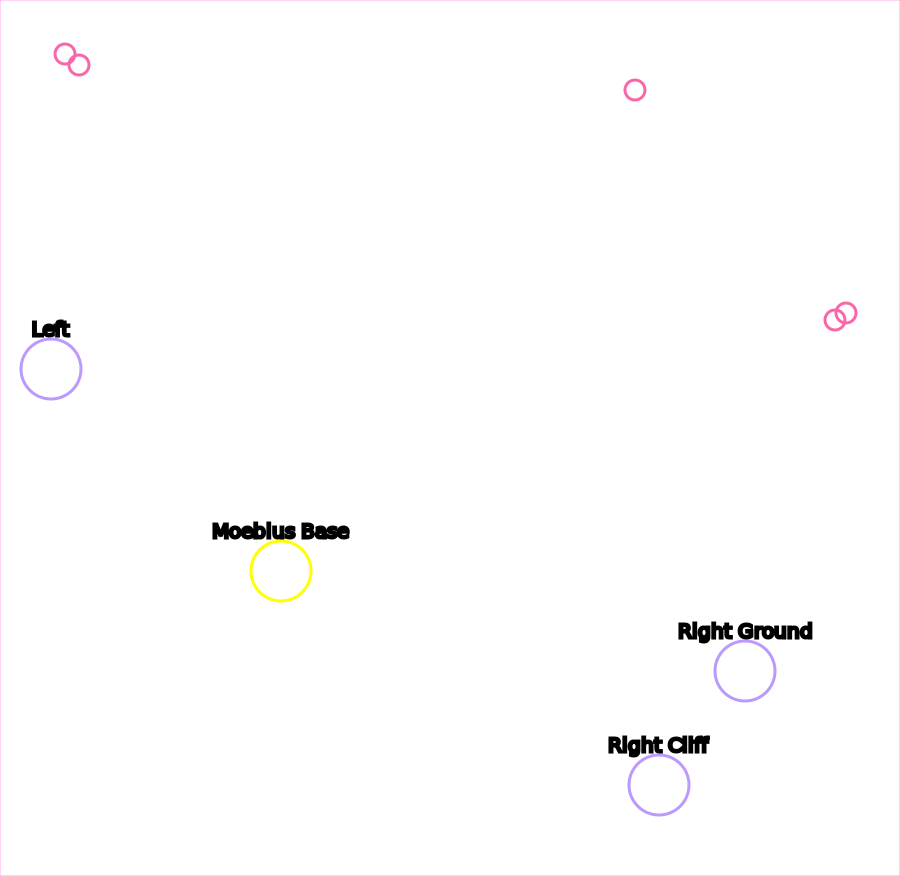
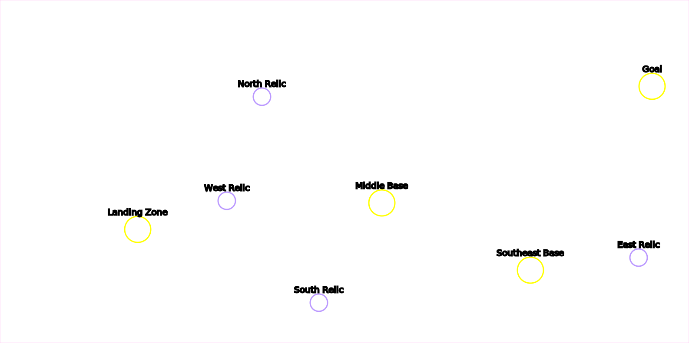

# Wings of Liberty Campaign Locations

<h2>Table of Contents</h2>
<ol>
<li>Mar Sara</li><ol>
  <li>[Liberation Day](#Liberation-Day)</li>
  <li>[The Outlaws](#The-Outlaws)</li>
  <li>[Zero Hour](#Zero-Hour)</li>
</ol><li>Colonist</li><ol>
  <li>[Evacuation](#Evacuation)</li>
  <li>[Outbreak](#Outbreak)</li>
  <li>[Safe Haven](#Safe-Haven)</li>
  <li>[Haven's Fall](#Haven's-Fall)</li>
</ol><li>Artifact</li><ol>
   <li>[Smash and Grab](#Smash-and-Grab)</li>
   <li>[The Dig](#The-Dig)</li>
   <li>[The Moebius Factor](#The-Moebius-Factor)</li>
   <li>[Supernova](#Supernova)</li>
   <li>[Maw of the Void](#Maw-of-the-Void)</li>
</ol><li>Covert</li><ol>
   <li>[The Devil's Playground](#The-Devil's-Playground)</li>
   <li>[Welcome to the Jungle](#Welcome-to-the-Jungle)</li>
   <li>[Breakout](#Breakout)</li>
   <li>[Ghost of a Chance](#Ghost-of-a-Chance)</li>
</ol></ol>

## Contibutors
* Phaneros (aka "Phanerus") -- General code / tooling / HTML
* Neocerber -- Map pictures
* Mati -- Proof of concept

## Liberation Day

* **Bonus** 6 statues
* **Progression** Special Delivery
* **Progression** Victory

## The Outlaws

* **Bonus** North Resource Pickups
* **Bonus** Rebel Base
* **Progression** Nice job takin' out that bunker, Jimmy
* **Progression** Victory

## Zero Hour

* **Bonus** First Group Rescued
* **Bonus** Second Group Rescued
* **Bonus** Third Group Rescued
* **Challenge** Kill 1 Hathery
* **Challenge** Kill 2 Hatheries
* **Challenge** Kill 3 Hatheries
* **Challenge** Kill 4 Hatheries
* **Progression** Victory

### Tips
* The enemy rebuilds their hatcheries, and killing morphing hatcheries counts towards the check

## Evacuation

* **Secret** Secret resource stash 
  * Note: This is reachable right at the start of the mission
* **Bonus** First Crysalis
* **Bonus** Second Crysalis
* **Bonus** Third Crysalis
* **Progression** Reach Hanson
* **Progression** Victory
* **Challenge** Don't lose any colonist or truck

## Outbreak

* **Bonus** Larry the Left infestor
* **Bonus** Reggie the Right infestor
* **Progression** Victory

## Safe Haven

* **Bonus** First Terror Fleet
* **Bonus** Second Terror Fleet
* **Bonus** Third Terror Fleet
* **Progression** North Nexus
* **Progression** East Nexus
* **Progression** South Nexus
* **Progression** Victory

## Haven's Fall

* **Progression** North Hive
* **Progression** East Hive
* **Progression** South Hive
* **Progression** Victory
* **Challenge** Northeast Colony Base
* **Challenge** East Colony Base
* **Challenge** Middle Colony Base
* **Challenge** Southeast Colony Base
* **Challenge** Southwest Colony Base

### Tips
* You can send one of your starting vikings south to gas island at the start of the mission to get +600 starting gas

## Smash and Grab

* **Bonus** First Relic
* **Bonus** Second Relic
* **Bonus** Third Relic
* **Bonus** Fourth Relic
* **Progression** First Forcefield Area Busted
* **Progression** Second Forcefield Area Busted
* **Progression** Victory

### Tips
* All the artifacts can be acquired without units, by loading SCVs into your command center and flying it around

## The Dig

* **Bonus** Left Relic
* **Bonus** Right Ground Relic
* **Bonus** Right Cliff Relic
* **Progression** Moebius Base
* **Progression** Victory

### Tips
* The top bases will not reinforce the right base; you can fly a building over the cliffs and snipe probes and pylons and the top base will not rebuild it
* There are five "special pylons" (annotated above) in 3 groups. Kill all the Pylons in a group, and the Warp Prism / air wave won't spawn from that direction

## The Moebius Factor

* **Bonus** South Rescue
* **Bonus** Wall Rescue
* **Bonus** Mid Rescue
* **Bonus** Nydus Roof Rescue
* **Bonus** Alive Inside Rescue
* **Bonus** Brutalisk (Moe)
* **Progression** 1st Data Core
* **Progression** 2nd Data Core
* **Progression** 3rd Data Core
* **Progression** Victory

### Tips
* The 1st data core can be cleaned up from the highground with just your starting units and the south rescue group
* The 2nd data core can be killed from the low-ground with just one ranged unit. To drop this unit, the medivac must circle the entire northeastern base
* Missile Turrets on Moe's island can heavily slow down or outright stop many attack waves

## Supernova

* **Bonus** West Relic
* **Bonus** North Relic
* **Bonus** South Relic
* **Bonus** East Relic
* **Progression** Landing Zone Cleared
* **Progression** Middle Base
* **Progression** Southeast Base
* **Progression** Victory

## Maw of the Void

* **Bonus** Expansion Prisoners
* **Bonus** South Close Prisoners
* **Bonus** South Far Prisoners
* **Bonus** North Prisoners
* **Bonus** Mothership
* **Progression** Landing Zone Cleared
* **Progression** Expansion Rip Field Generator
* **Progression** Middle Rip Field Generator
* **Progression** Southeast Rip Field Generator
* **Progression** Stargate Rip Field Generator
* **Progression** Northwest Rip Field Generator
* **Progression** West Rip Field Generator
* **Progression** Southwest Rip Field Generator
* **Progression** Victory

### Tips
* The Nerazim Dark Templar you rescue can use Shadow Fury to snipe cannons from outside their detection range

## The Devil's Playground

* **Bonus** Tosh's Miners
* **Bonus** Brutalisk (Lucy)
* **Bonus** North Reapers
* **Bonus** Middle Reapers
* **Bonus** Southwest Reapers
* **Bonus** Southeast Reapers
* **Bonus** East Reapers
* **Progression** Victory

## Welcome to the Jungle

* **Bonus** Close Relic
* **Bonus** West Relic
* **Bonus** North-East Relic
* **Bonus** Middle Base
* **Progression** Victory
* **Challenge** Main Base
  * Note: This objective requires destroying _all_ protoss on the map, including outlying bases
* **Challenge** No Terrazine Nodes Sealed
* **Challenge** Up to 1 Terrazine Node Sealed
* **Challenge** Up to 2 Terrazine Nodes Sealed
* **Challenge** Up to 3 Terrazine Nodes Sealed
* **Challenge** Up to 4 Terrazine Nodes Sealed
* **Challenge** Up to 5 Terrazine Nodes Sealed

## Breakout

* **Bonus** Diamondback Prison
* **Bonus** Siege Tank Prison
* **Progression** First Checkpoint
* **Progression** Second Checkpoint
* **Progression** Victory

## Ghost of a Chance

* **Bonus** First Island Spectres
* **Bonus** Second Island Spectres
* **Bonus** Third Island Spectres
* **Progression** Terrazine Tank
* **Progression** Jorium Stockpile
* **Progression** Victory
