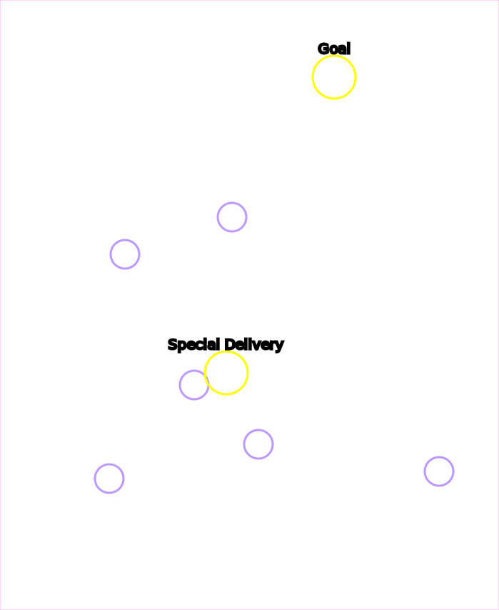

# Wings of Liberty Campaign Locations

<h2>Table of Contents</h2>
<ol>
<li>Mar Sara</li><ol>
  <li>[Liberation Day](#Liberation-Day)</li>
  <li>[The Outlaws](#The-Outlaws)</li>
  <li>[Zero Hour](#Zero-Hour)</li>
</ol><li>Colonist</li><ol>
  <li>[Evacuation](#Evacuation)</li>
  <li>[Outbreak](#Outbreak)</li>
  <li>[Safe Haven](#Safe-Haven)</li>
  <li>[Haven's Fall](#Haven's-Fall)</li>
</ol><li>Artifact</li><ol>
   <li>[Smash and Grab](#Smash-and-Grab)</li>
   <li>[The Dig](#The-Dig)</li>
</ol></ol>

## Contibutors
* Phaneros (aka "Phanerus") -- General code / tooling / HTML
* Neocerber -- Map pictures
* Mati -- Proof of concept

## Liberation Day

* **Bonus** 6 statues
* **Progression** Special Delivery
* **Progression** Victory

## The Outlaws

* **Bonus** Resource Pickups
* **Bonus** Rescue Rebel Base
* **Progression** Nice job takin' out that bunker, Jimmy
* **Progression** Victory

## Zero Hour

* **Bonus** Rescue groups 1~3
* **Challenge** 4x kill a hatchery
* **Progression** Victory

### Tips
* The enemy rebuilds their hatcheries, and killing morphing hatcheries counts towards the check

## Evacuation

* **Secret** Secret resource stash 
  * Note: This is reachable right at the start of the mission
* **Bonus** 3x Zerg Crysalis
* **Progression** Reach the colonist base
* **Progression** Victory
* **Challenge** Don't lose any colonist or truck

## Outbreak

* **Bonus** Larry the Left infestor
* **Bonus** Reggie the Right infestor
* **Progression** Victory

## Safe Haven

* **Bonus** First Terror Fleet
* **Bonus** Second Terror Fleet
* **Bonus** Third Terror Fleet
* **Progression** North Nexus
* **Progression** East Nexus
* **Progression** South Nexus
* **Progression** Victory

## Haven's Fall

* **Progression** North Hive
* **Progression** East Hive
* **Progression** South Hive
* **Progression** Victory
* **Challenge** Northeast Colony Base
* **Challenge** East Colony Base
* **Challenge** Middle Colony Base
* **Challenge** Southeast Colony Base
* **Challenge** Southwest Colony Base

## Smash and Grab

* **Bonus** First Relic
* **Bonus** Second Relic
* **Bonus** Third Relic
* **Bonus** Fourth Relic
* **Progression** First Forcefield Area Busted
* **Progression** Second Forcefield Area Busted
* **Progression** Victory

### Tips
* All the artifacts can be acquired without units, by loading SCVs into your command center and flying it around

## The Dig

* **Bonus** Left Relic
* **Bonus** Right Ground Relic
* **Bonus** Right Cliff Relic
* **Progression** Moebius Base
* **Progression** Victory

### Tips
* The top bases will not reinforce the right base; you can fly a building over the cliffs and snipe probes and pylons and the top base will not rebuild it
* There are five "special pylons" (annotated above) in 3 groups. Kill all the Pylons in a group, and the Warp Prism / air wave won't spawn from that direction

## The Moebius Factor

## Supernova

## Maw of the Void
