# Wings of Liberty Campaign Locations

<h2>Table of Contents</h2>
1. Mar Sara
  1. [Liberation Day](#Liberation-Day)
  2. [The Outlaws](#The-Outlaws)
  3. [Zero Hour](#Zero-Hour)
2. Colonist
  1. [Evacuation](#Evacuation)
  2. [Outbreak](#Outbreak)
  3. [Safe Haven](#Safe-Haven)
  4. [Haven's Fall](#Haven's-Fall)
3. Artifact
   1. [Smash and Grab](#Smash-and-Grab)
   2. [The Dig](#The-Dig)
   3. [The Moebius Factor](#The-Moebius-Factor)
   4. [Supernova](#Supernova)
   5. [Maw of the Void](#Maw-of-the-Void)
4. Covert
   1. [The Devil's Playground](#The-Devil's-Playground)
   2. [Welcome to the Jungle](#Welcome-to-the-Jungle)
   3. [Breakout](#Breakout)
   4. [Ghost of a Chance](#Ghost-of-a-Chance)
5. Rebellion
   1. [The Great Train Robbery](#The-Great-Train-Robbery)
   2. [Cutthroat](#Cutthroat)
   3. [Engine of Destruction](#Engine-of-Destruction)
   4. [Media Blitz](#Media-Blitz)
   5. [Piercing the Shroud](#Piercing-the-Shroud)
6. Prophecy
   1. [Whispers of Doom](#Whispers-of-Doom)
   2. [A Sinster Turn](#A-Sinister-Turn)
   3. [Echoes of the Future](#Echoes-of-the-Future)
   4. [In Utter Darkness](#In-Utter-Darkness)
7. Char
   1. [The Gates of Hell](#The-Gates-of-Hell)
   2. [Belly of the Beast](#Belly-of-the-Beast)
   3. [Shatter the Sky](#Shatter-the-Sky)
   4. [All-In](#All-In)

## Contibutors
* Phaneros (aka "Phanerus") -- General code / tooling / HTML
* Neocerber -- Map pictures
* Mati -- Proof of concept

## Liberation Day

* **Bonus** 6 statues
* **Progression** Special Delivery
* **Victory**

## The Outlaws

* **Bonus** Clear the North Resource Pickups
* **Bonus** Rescue the Rebel Base
* **Progression** Nice job takin' out that bunker, Jimmy
* **Victory**

## Zero Hour
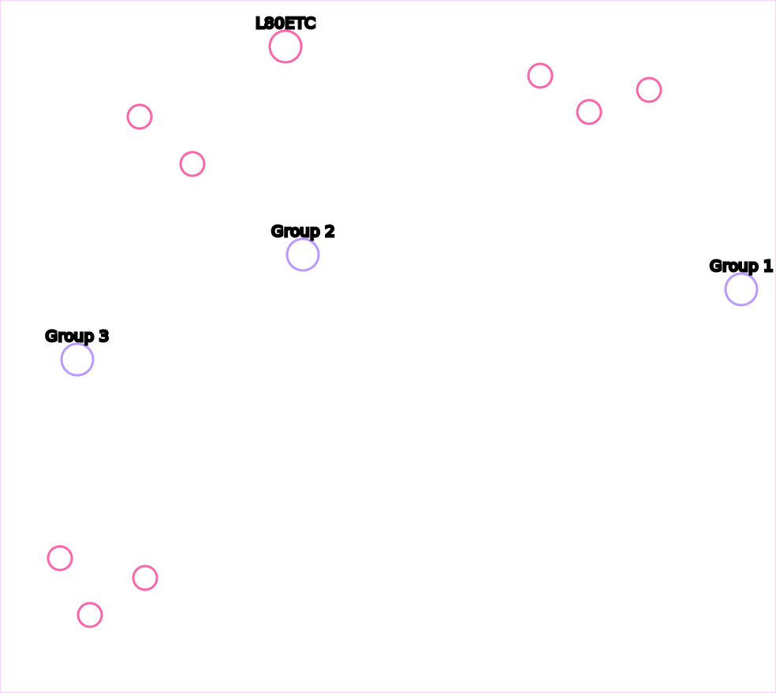

* **Bonus** First Group Rescued
* **Bonus** Second Group Rescued
* **Bonus** Third Group Rescued
* **Challenge** Kill 1 Hatchery
* **Challenge** Kill 2 Hatcheries
* **Challenge** Kill 3 Hatcheries
* **Challenge** Kill 4 Hatcheries
* **Victory**

### Tips
* The enemy rebuilds their hatcheries, and killing morphing hatcheries counts towards the check
* Meet L80ETC, the Tauren Marine who was transported to the Koprulu Sector

## Evacuation

* **Secret** Secret resource stash 
  * Note: This is reachable right at the start of the mission
* **Bonus** First Crysalis
* **Bonus** Second Crysalis
* **Bonus** Third Crysalis
* **Progression** Reach Hanson
* **Challenge** Don't lose any colonist or truck
* **Victory**

## Outbreak

* **Bonus** Defeat Larry the Left infestor
* **Bonus** Defeat Reggie the Right infestor
* **Progression** Destroy the North Infested Command Center
* **Progression** Destroy the South Infested Command Center
* **Progression** Destroy the Northwest Bar
* **Progression** Destroy the North Bar
* **Progression** Destroy the South Bar
* **Victory**

## Safe Haven

* **Bonus** Defeat the First Terror Fleet
* **Bonus** Defeat the Second Terror Fleet
* **Bonus** Defeat the Third Terror Fleet
* **Progression** North Nexus
* **Progression** East Nexus
* **Progression** South Nexus
* **Victory**

## Haven's Fall
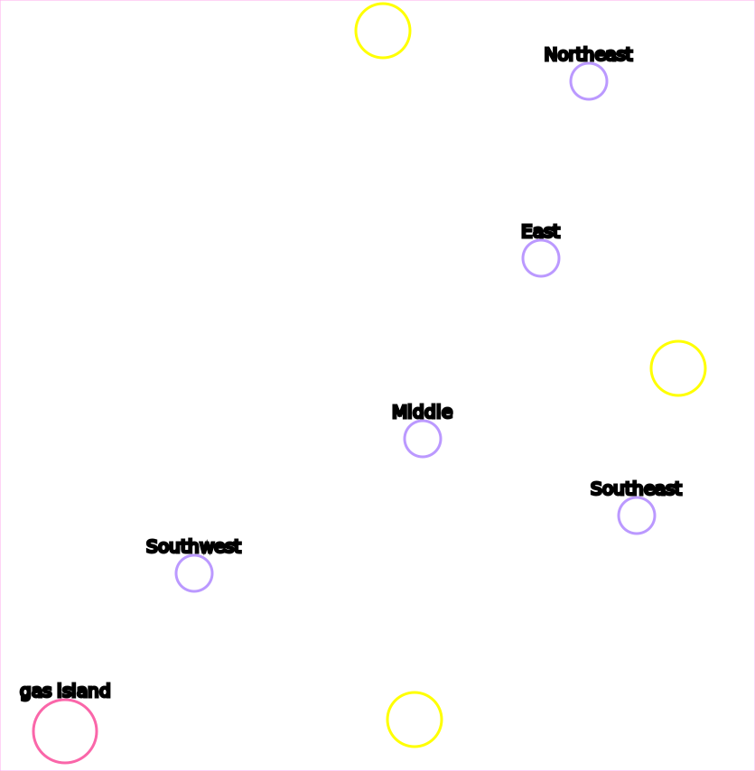

* **Progression** North Hive
* **Progression** East Hive
* **Progression** South Hive
* **Challenge** Northeast Colony Base
* **Challenge** East Colony Base
* **Challenge** Middle Colony Base
* **Challenge** Southeast Colony Base
* **Challenge** Southwest Colony Base
* **Victory**

### Tips
* You can send one of your starting vikings south to gas island at the start of the mission to get +600 starting gas

## Smash and Grab

* **Bonus** First Relic
* **Bonus** Second Relic
* **Bonus** Third Relic
* **Bonus** Fourth Relic
* **Progression** First Forcefield Area Busted
* **Progression** Second Forcefield Area Busted
* **Victory**

### Tips
* All the artifacts can be acquired without units, by loading SCVs into your command center and flying it around

## The Dig

* **Bonus** Left Relic
* **Bonus** Right Ground Relic
* **Bonus** Right Cliff Relic
* **Progression** Moebius Base
* **Victory**

### Tips
* The top bases will not reinforce the right base; you can fly a building over the cliffs and snipe probes and pylons and the top base will not rebuild it
* There are five "special pylons" (annotated above) in 3 groups. Kill all the Pylons in a group, and the Warp Prism / air wave won't spawn from that direction

## The Moebius Factor
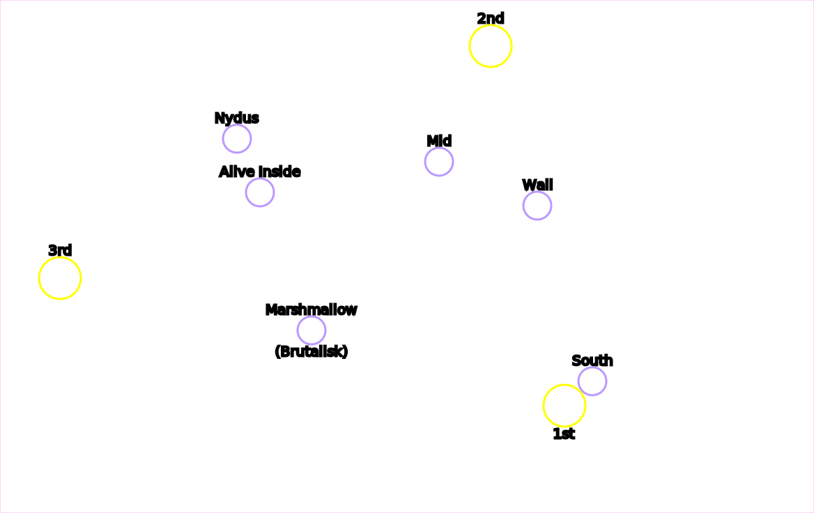

* **Bonus** South Rescue
* **Bonus** Wall Rescue
* **Bonus** Mid Rescue
* **Bonus** Nydus Roof Rescue
* **Bonus** Alive Inside Rescue
* **Boss** Defeat Marshmallow the Moebius Brutalisk
* **Progression** 1st Data Core
* **Progression** 2nd Data Core
* **Progression** 3rd Data Core
* **Victory**

### Tips
* The 1st data core can be cleaned up from the highground with just your starting units and the south rescue group
* The 2nd data core can be killed from the low-ground with just one ranged unit. To drop this unit, the medivac must circle the entire northeastern base
* Missile Turrets on Moe's island can heavily slow down or outright stop many attack waves

## Supernova

* **Bonus** West Relic
* **Bonus** North Relic
* **Bonus** South Relic
* **Bonus** East Relic
* **Progression** Landing Zone Cleared
* **Progression** Middle Base
* **Progression** Southeast Base
* **Victory**

## Maw of the Void

* **Bonus** Expansion Prisoners
* **Bonus** South Close Prisoners
* **Bonus** South Far Prisoners
* **Bonus** North Prisoners
* **Boss** Mothership
* **Progression** Landing Zone Cleared
* **Progression** Expansion Rip Field Generator
* **Progression** Middle Rip Field Generator
* **Progression** Southeast Rip Field Generator
* **Progression** Stargate Rip Field Generator
* **Progression** Northwest Rip Field Generator
* **Progression** West Rip Field Generator
* **Progression** Southwest Rip Field Generator
* **Victory**

### Tips
* The Nerazim Dark Templar you rescue can use Shadow Fury to snipe cannons from outside their detection range
* L80ETC is occasionally seen flying his spaceship in the background of the mission

## The Devil's Playground
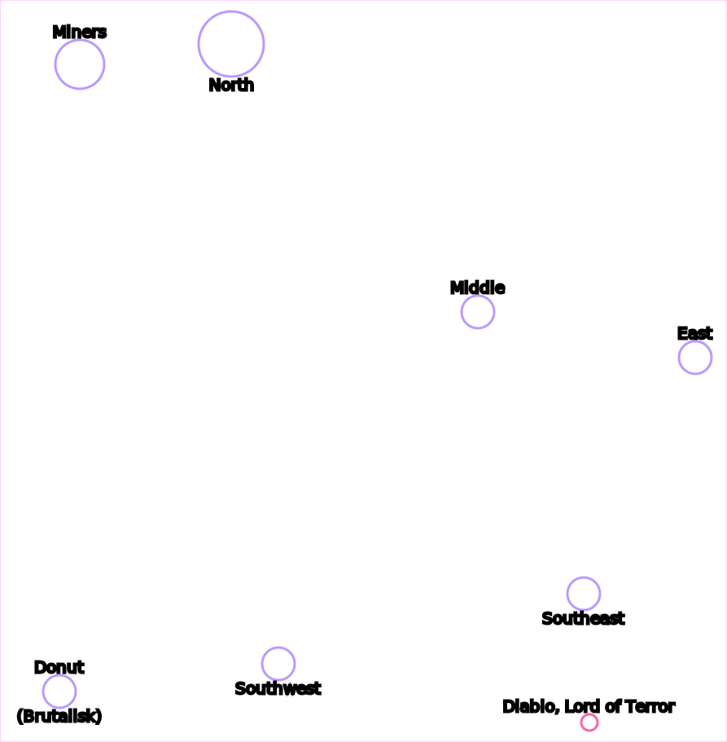

* **Bonus** Tosh's Miners
* **Bonus** North Reapers
* **Bonus** Middle Reapers
* **Bonus** Southwest Reapers
* **Bonus** Southeast Reapers
* **Bonus** East Reapers
* **Boss** Defeat Donut the Devilish Brutalisk
* **Victory**

## Welcome to the Jungle

* **Bonus** Close Relic
* **Bonus** West Relic
* **Bonus** North-East Relic
* **Bonus** Middle Base
* **Challenge** Main Base
  * Note: This objective requires destroying _all_ protoss on the map, including outlying bases
* **Challenge** No Terrazine Nodes Sealed
* **Challenge** Up to 1 Terrazine Node Sealed
* **Challenge** Up to 2 Terrazine Nodes Sealed
* **Challenge** Up to 3 Terrazine Nodes Sealed
* **Challenge** Up to 4 Terrazine Nodes Sealed
* **Challenge** Up to 5 Terrazine Nodes Sealed
* **Victory**

## Breakout

* **Bonus** Diamondback Prison
* **Bonus** Siege Tank Prison
* **Progression** First Checkpoint
* **Progression** Second Checkpoint
* **Victory**

## Ghost of a Chance

* **Bonus** First Island Spectres
* **Bonus** Second Island Spectres
* **Bonus** Third Island Spectres
* **Progression** Terrazine Tank
* **Progression** Jorium Stockpile
* **Victory**

### Tips
* L80ETC is occasionally seen flying his spaceship in the background of the mission

## The Great Train Robbery
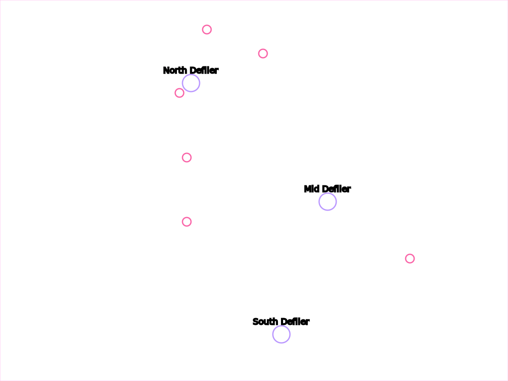

* **Bonus** North Defiler
* **Bonus** Mid Defiler
* **Bonus** South Defiler
* **Bonus** Close Diamondback
* **Bonus** Northwest Diamondback
* **Bonus** North Diamondback
* **Bonus** Northeast Diamondback
* **Bonus** Southwest Diamondback
* **Bonus** Southeast Diamondback
* **Challenge** Kill Team
* **Victory**

## Cutthroat
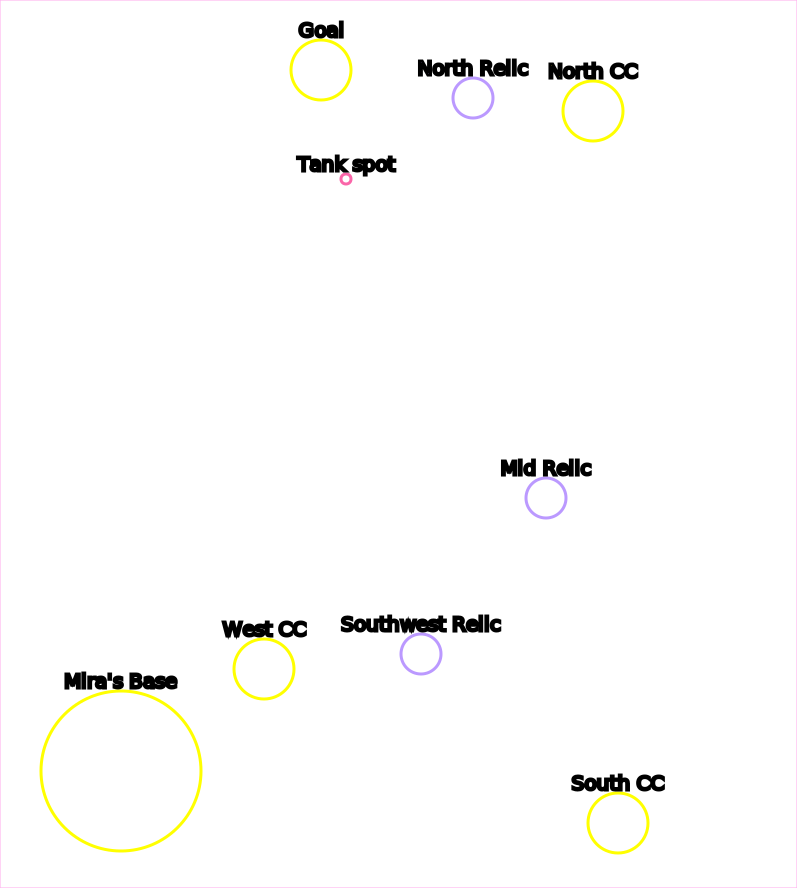

* **Bonus** North Relic
* **Bonus** Mid Relic
* **Bonus** Southwest Relic
* **Progression** North Command Center
* **Progression** South Command Center
* **Progression** West Command Center
* **Progression** Hire Mira Han
* **Victory**

### Tips
* Siege tanks can hit Orlan's command center from the low ground south of it, at the spot labeled "tank spot". If siege tanks are not unlocked, you can hire Mira and use her Siege Breakers
* Technically, none of the progression locations are required to beat the mission; you can win by killing Orlan's Command Center without hiring Mira
* On easier difficulties (tested on normal and lower) with Planetary Fortresses unlocked, it's possible to build an engineering bay, load SCVs into your starting Command Center, float and land it in Orlan's base, and upgrade to a Planetary right next to him. The SCVs must repair to keep the planetary alive

## Engine of Destruction

* **Bonus** Lab Devourer Sample
* **Bonus** North Devourer Sample
* **Bonus** Southeast Devourer Sample
* **Boss** Defeat the Loki
* **Progression** Reach the Odin
* **Progression** West Base
* **Progression** Northwest Base
* **Progression** Northeast Base
* **Progression** Southeast Base
* **Victory**

## Media Blitz

* **Bonus** Science Facility's secret documents
* **Progression** Tower 1
* **Progression** Tower 2
* **Progression** Tower 3
* **Progression** Destroy all barracks
* **Progression** Destroy all factories
* **Progression** Destroy all starports
* **Challenge** Win without losing the Odin
* **Victory**

### Tips
* With a good route on the sneak attack, it is possible to eliminate the command center and all factories in the factory base and the command center and all starports in the starport base. The enemy will send remaining defenders in the bases in attack waves, but will run out after about 2 per base
* There are 19 barracks, factories, and starports on the map. All starports are in the starport base, but factories and barracks are spread among all bases

## Piercing the Shroud

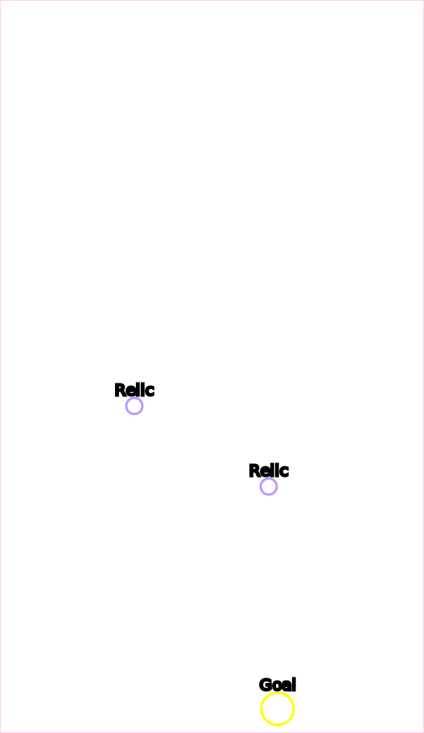

* **Bonus** Holding Cell Relic
* **Bonus** Brutalisk Relic
* **Bonus** First Escape Relic
* **Bonus** Second Escape Relic
* **Boss** Sherbet the Shrouded Brutalisk
* **Progression** Fusion Reactor
* **Victory**

### Tips
* If you've never seen this mission before, it's a secret mission normally unlocked by collecting the secret documents in Media Blitz
* Murky is on this map in a marine suit

## Whispers of Doom

* **Bonus** First Hatchery
* **Bonus** Second Hatchery
* **Bonus** Third Hatchery
* **Progression** First Prophecy Fragment
* **Progression** Second Prophecy Fragment
* **Progression** Third Prophecy Fragment
* **Victory**

### Tips
* The first couple of sections can be skipped by blinking Zeratul over the wall using vision you get around the marked point
* The third hatchery can be hit from the low-ground by your stalkers. No need to fight throught all the roaches and spine crawlers

## A Sinister Turn

* **Bonus** Power the Robotics Facility
* **Bonus** Power the Dark Shrine
* **Bonus** Power the Templar Archives
* **Progression** Destroy the Northeast Base
* **Progression** Destroy the Southwest Base
* **Progression** Defeat Maar the first time
* **Progression** Northwest Preserver
* **Progression** Southwest Preserver
* **Progression** East Preserver
* **Victory**

## Echoes of the Future

* **Bonus** Close Obelisk
* **Bonus** West Obelisk
* **Progression** Obtain a Base
* **Progression** Southwest Tendril
* **Progression** Southeast Tendril
* **Progression** Northeast Tendril
* **Progression** Northwest Tendril
* **Victory**

## In Utter Darkness

* **Bonus** Protect the Protoss Archive for 15 minutes
* **Challenge** Kills
  * 1500 (Casual and Normal) / 2000 (Hard) / 2500 (Brutal)
* **Progression** Survive until Urun arrives
* **Progression** Survive until Mohandar arrives
* **Progression** Survive until Selendis arrives
* **Progression** Survive until Artanis arrives
* **Victory** (or defeat, in this case)

## The Gates of Hell
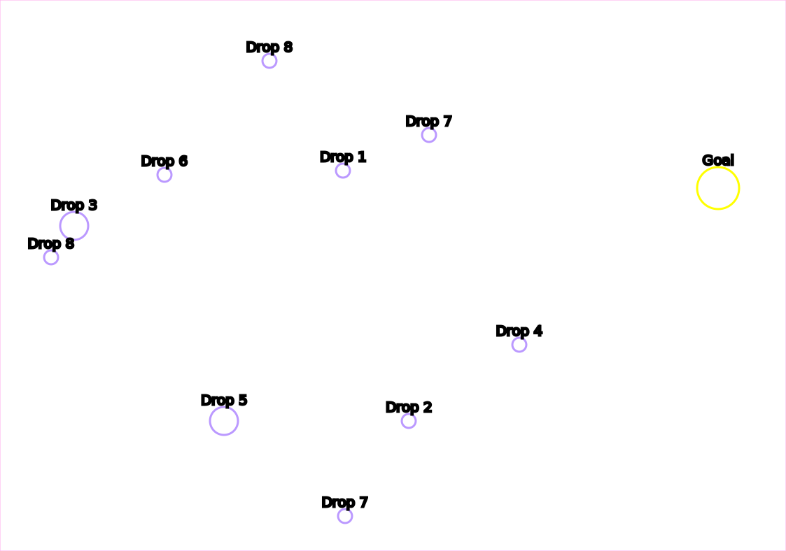

* **Progression** Gather a Large Army (100 supply)
* **Progression** Rescue 2 Drop Pods
* **Progression** Rescue 4 Drop Pods
* **Progression** Rescue 6 Drop Pods
* **Progression** Rescue 8 Drop Pods
* **Victory**

## Belly of the Beast
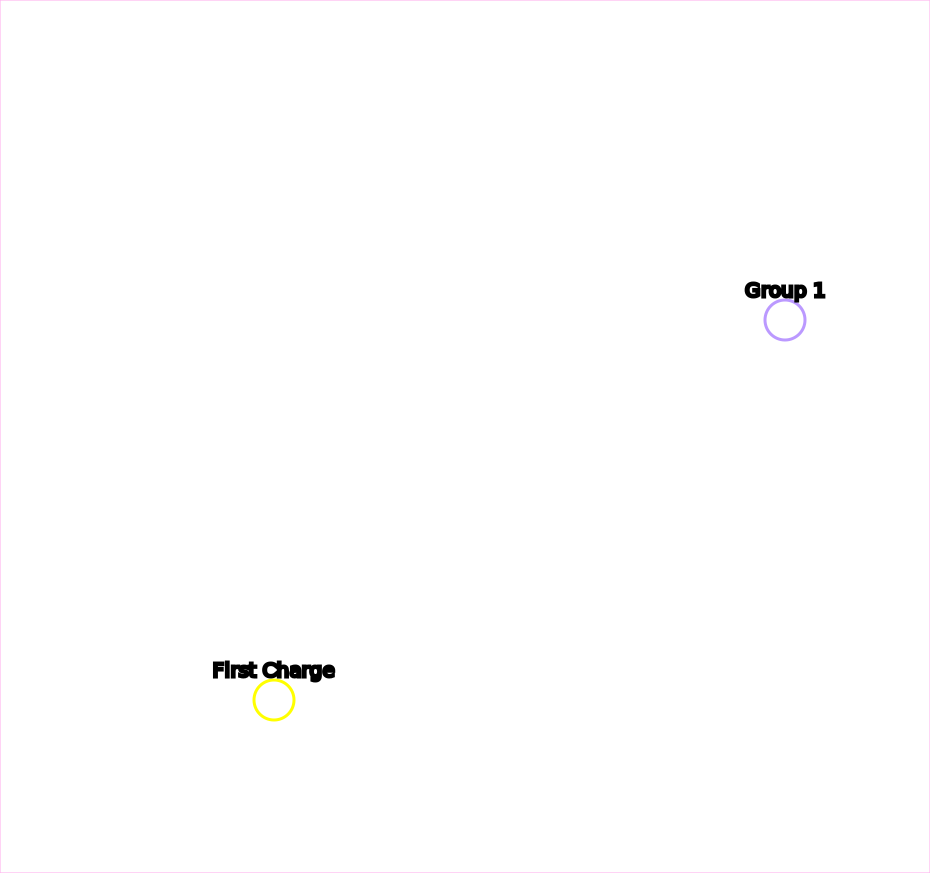
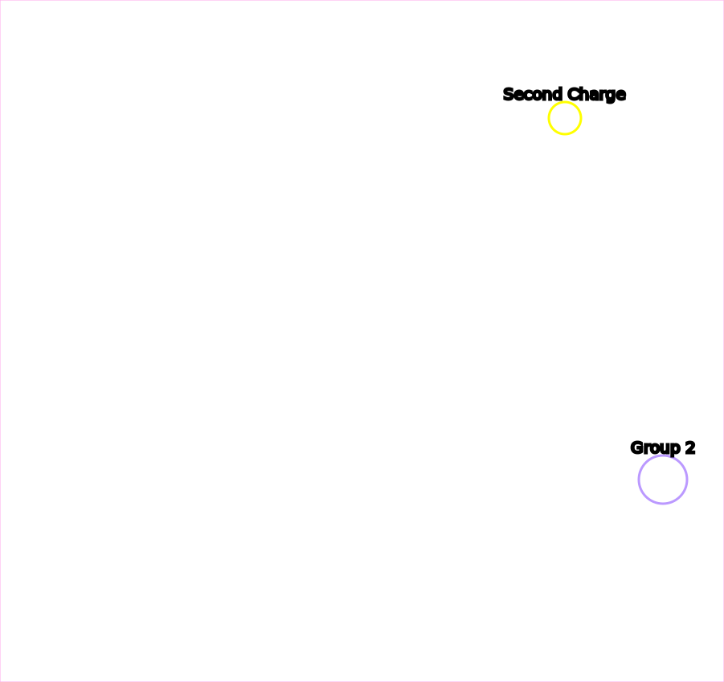

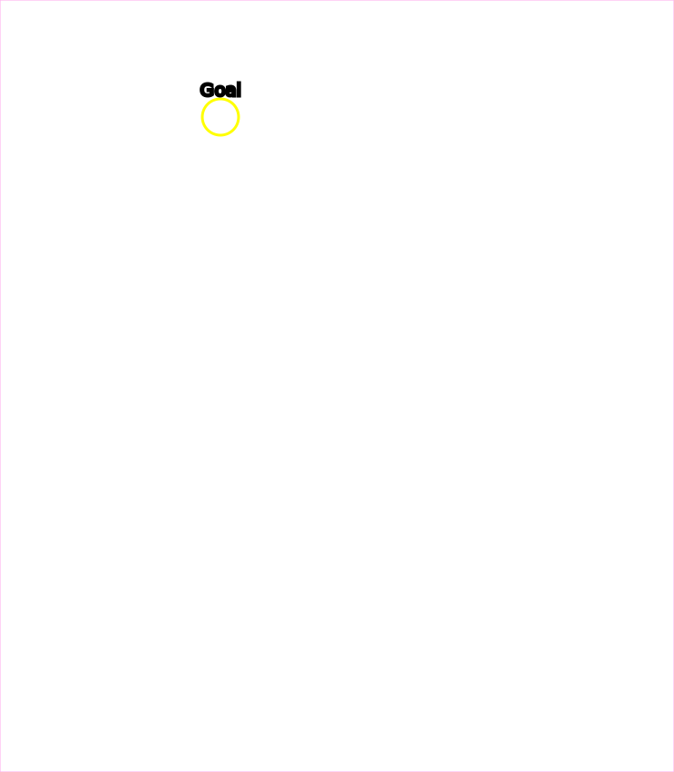

* **Bonus** First Group Rescued
* **Bonus** Second Group Rescued
* **Bonus** Third Group Rescued
* **Progression** First Charge
* **Progression** Second Charge
* **Progression** Third Charge
* **Victory**

## Shatter the Sky

* **Progression** Close Coolant Tower
* **Progression** Northwest Coolant Tower
* **Progression** Southeast Coolant Tower
* **Progression** Southwest Coolant Tower
* **Progression** East Hatchery
* **Progression** North Hatchery
* **Progression** Mid Hatchery
* **Boss** Leviathan
* **Victory**

## All-In
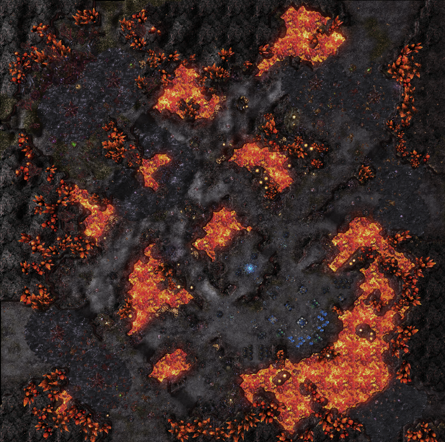

* **Victory**

